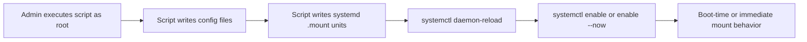
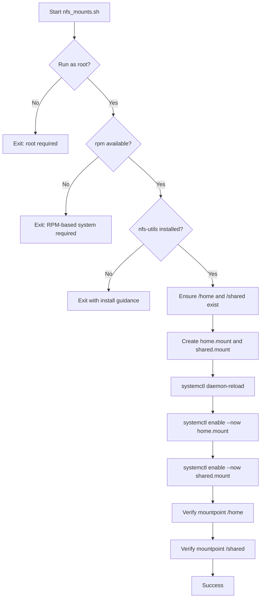
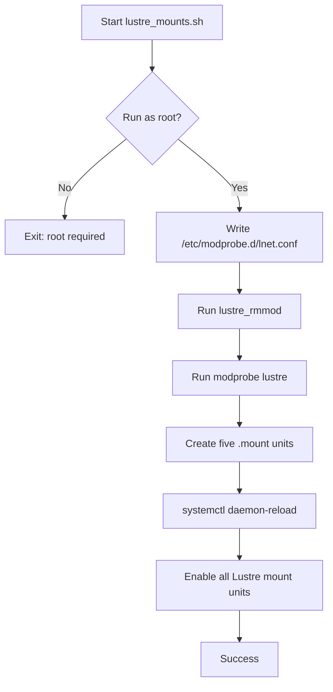

# Storage Mount Operations Document

## 1. Document Purpose

This document explains the workflow, systemd artifacts, and operational steps for:

1. [nfs_mounts.sh](nfs_mounts.sh)
2. [lustre_mounts.sh](lustre_mounts.sh)

Target audience: Linux administrators managing NFS and Lustre client mount configuration through systemd mount units.

## 2. High-Level Architecture



## 3. NFS Workflow

Source script: [nfs_mounts.sh](nfs_mounts.sh)

### 3.1 NFS Process Flow



### 3.2 Generated NFS Units

1. /etc/systemd/system/home.mount
2. /etc/systemd/system/shared.mount

### 3.3 NFS Mount Definitions

| Unit | What | Where | Type | Options |
|---|---|---|---|---|
| home.mount | FZ2BVIP1.mpfile2.int.oden2.com:/ODEN2Shares/Home | /home | nfs | _netdev,sec=sys,vers=4.2,noresvport,context=system_u:object_r:ssh_home_t:s0 |
| shared.mount | FZ2AVIP1.mpfile1.int.oden2.com:/ODEN2Shares/Shared | /shared | nfs | _netdev,sec=sys,vers=4.2,noresvport |

## 4. Lustre Workflow

Source script: [lustre_mounts.sh](lustre_mounts.sh)

### 4.1 Lustre Process Flow



### 4.2 LNet Configuration Artifact

1. /etc/modprobe.d/lnet.conf

Content:

```conf
options lnet networks=o2ib20(ibs6)
```

### 4.3 Generated Lustre Units

1. /etc/systemd/system/bfz22.mount
2. /etc/systemd/system/boutput_hub.mount
3. /etc/systemd/system/fz21.mount
4. /etc/systemd/system/fz24.mount
5. /etc/systemd/system/output_hub.mount

## 5. Execution Procedure

```bash
sudo ./nfs_mounts.sh
sudo ./lustre_mounts.sh
```

## 6. Validation Workflow


Commands:

```bash
systemctl status home.mount shared.mount
systemctl status bfz22.mount boutput_hub.mount fz21.mount fz24.mount output_hub.mount
mount | egrep ' /home | /shared | /bfz22 | /boutput_hub | /fz21 | /fz24 | /output_hub '
```

## 7. Operational Notes

1. These scripts are designed for Linux systems using systemd.
2. Unit files are overwritten on each script run.
3. In [nfs_mounts.sh](nfs_mounts.sh), enable uses --now, so mounts are started immediately.
4. In [lustre_mounts.sh](lustre_mounts.sh), units are enabled for boot using systemctl enable.
5. Mounting NFS on /home can hide local home content while mounted.
